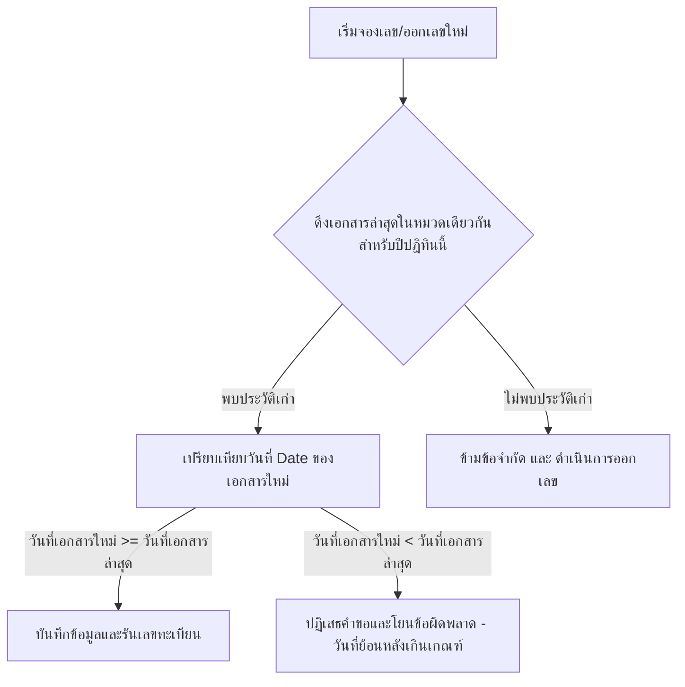

# Design Spec - Flexible Document Numbering System (ระบบทะเบียนคุมเอกสารและขอเลขออนไลน์)

เอกสารระบุคุณลักษณะเชิงออกแบบและสถาปัตยกรรมระบบสำหรับการพัฒนาระบบย่อยงานเอกสาร ได้แก่ **บันทึกข้อความ (Memo)**, **คำสั่ง (Command/Order)**, และ**หนังสือส่ง (Outgoing Letter)** โดยระบบนี้จะถูกรวมอยู่ในโปรเจกต์เดิม ([eLeave](file:///g:/My%20Drive/01%20Web%20app/01%20ระบบการลา/eLeave)) โดยแยกสิทธิ์และ Layout ชัดเจน และใช้ฐานข้อมูลร่วมกันเพื่อทำ Single Sign-On (SSO)

---

## 1. ขอบเขตความต้องการและฟีเจอร์หลัก (Requirements & Features)

### 1.1 การออกเลขทะเบียนและการคุมเลข
1. **ระบบเลขปีปฏิทินเท่านั้น**: เลขปีในหนังสือรันตามปีปฏิทิน (1 ม.ค. - 31 ธ.ค.)
2. **การขอเลขย้อนหลังแบบมีข้อจำกัด**: ผู้ใช้สามารถขอเลขย้อนหลังได้ แต่**ห้ามลงวันที่ย้อนหลังไปไกลกว่าวันที่ของเอกสารล่าสุดในหมวดนั้น** เพื่อรักษาความสัมพันธ์เชิงลำดับเลขและเวลาในทะเบียนคุม
3. **การจัดการส่วนงานย่อย (CRUD Memo Sections)**: บันทึกข้อความสามารถแยกเลขวิ่งตามฝ่าย/งานย่อย เช่น งานบุคคล, งานวิชาการ โดยแต่ละกลุ่มจะมีเลขวิ่งเป็นของตัวเอง
4. **Visual Pattern Builder**: ผู้ดูแลระบบสามารถตั้งค่ารูปแบบเลขได้ง่ายผ่านสวิตช์และกล่องข้อความ (เช่น อักขระนำหน้า, สลับเลขไทย/อารบิก, เลือกจำนวนหลัก)
5. **Smart Running Number Preview**: แสดงเลขที่จะได้รับแบบสด ๆ ในขณะที่กำลังกรอกข้อมูล

### 1.2 หน้าจอเขียนเอกสารและการพิมพ์
1. **Split-View Editor**: แบ่งสองฝั่ง ซีกซ้ายคือฟอร์มกรอกข้อมูลแบบทีละขั้น (Wizard Form) ซีกขวาคือกระดาษ A4 จำลองแสดงตัวอย่างสด (Live A4 Preview)
2. **Wizard Form**: แบ่ง 4 ขั้นตอน: เลือกประเภทเอกสาร -> กรอกเนื้อหาและรายละเอียด -> เลือกผู้ลงนาม -> ยืนยันออกเลข
3. **เทมเพลตมาตรฐานราชการ (ตราครุฑ)**: 
   * บันทึกข้อความ: ตราครุฑมุมซ้ายบน ใช้ฟอนต์มาตรฐาน (เช่น TH Sarabun หรือฟอนต์อื่น ๆ ที่ตั้งค่าได้) จัดวางตามระเบียบงานสารบรรณ
   * คำสั่งและหนังสือส่ง: ตราครุฑตรงกลางหน้ากระดาษ
4. **Export PDF & Web Print**: มีปุ่มสั่งพิมพ์และปุ่มดาวน์โหลดไฟล์ PDF โดยตรง
5. **Auto-Save Draft**: บันทึกแบบร่างอัตโนมัติลงเบราว์เซอร์หรือฐานข้อมูลทุก 30 วินาที เพื่อป้องกันข้อมูลสูญหาย

### 1.3 ความสะดวกสบายและความปลอดภัย
1. **ผู้ลงนามที่ใช้บ่อย (Signee Preset)**: บันทึกเทมเพลตชื่อและตำแหน่งผู้ลงนามที่ใช้บ่อย คลิกเลือกได้ใน 1 คลิก
2. **แม่แบบเอกสาร (Templates)**: สามารถบันทึกเนื้อหาเก็บไว้เป็นแม่แบบทั่วไปและส่วนตัว เพื่อความรวดเร็วในการขอเลขเรื่องเดิม ๆ
3. **การคัดลอกเอกสาร (Clone Document)**: คัดลอกเนื้อหาเอกสารชุดเดิมเพื่อขอเลขใหม่
4. **การยกเลิกเอกสารพร้อมระบุเหตุผล (Cancel with Reason)**: ขีดฆ่าเลขและคงประวัติไว้ในระบบ
5. **การเชื่อมโยงเอกสาร (Document Linking)**: เชื่อมโยงประวัติเอกสารเข้าด้วยกัน เช่น บันทึกข้อความ -> คำสั่งแต่งตั้ง -> หนังสือส่ง
6. **ทะเบียนคุมเอกสาร (Register Book Export)**: ส่งออกตารางรายการทะเบียนคุมแยกตามปีปฏิทินเป็น Excel/CSV
7. **Audit Log & Activity Feed**: ตรวจสอบการกระทำของยูสเซอร์ในประวัติย้อนหลัง และแถบฟีดกิจกรรมล่าสุดของทีม

---

## 2. โครงสร้างฐานข้อมูล (Database Schema)

เราจะทำการอัปเดตไฟล์ [schema.prisma](file:///g:/My%20Drive/01%20Web%20app/01%20ระบบการลา/eLeave/prisma/schema.prisma) โดยเพิ่มเติมตารางและขยายความสัมพันธ์ของ `User` ดังนี้:

```prisma
// เพิ่มเติมความสัมพันธ์ในโมเดล User เดิม
model User {
  id               String             @id @default(cuid())
  // ... (ฟิลด์เดิม) ...
  documentRecords  DocumentRecord[]
  templates        DocumentTemplate[]
}

// 1. หมวดหมู่/ส่วนงานย่อยสำหรับบันทึกข้อความ
model MemoSection {
  id               String             @id @default(cuid())
  name             String             // เช่น "งานบุคคล", "งานวิชาการ"
  code             String             @unique // เช่น "HR", "ACAD"
  isActive         Boolean            @default(true)
  createdAt        DateTime           @default(now())
  updatedAt        DateTime           @updatedAt
  
  documentConfigs  DocumentConfig[]
  documentRecords  DocumentRecord[]
  templates        DocumentTemplate[]
}

// 2. การตั้งค่ารูปแบบและตัวเลขวิ่ง
model DocumentConfig {
  id               String             @id @default(cuid())
  docType          String             // "MEMO" | "COMMAND" | "OUTGOING"
  memoSectionId    String?            @unique
  prefix           String             @default("") // เช่น "ศทก ๐๒" หรือ "ที่ ศทก"
  useThaiNumerals  Boolean            @default(true) // แสดงเป็นเลขไทย ๑, ๒, ๓...
  paddingDigits    Int                @default(1)    // เติมเลขศูนย์ข้างหน้า เช่น 1 -> "1", 3 -> "001"
  yearFormat       String             @default("TH_BE") // "TH_BE" (พ.ศ.) หรือ "EN_AD" (ค.ศ.)
  currentSeq       Int                @default(0)    // ลำดับตัวเลขล่าสุดที่รันในปีปัจจุบัน
  createdAt        DateTime           @default(now())
  updatedAt        DateTime           @updatedAt

  memoSection      MemoSection?       @relation(fields: [memoSectionId], references: [id], onDelete: Cascade)
}

// 3. ทะเบียนประวัติการขอเลขเอกสาร
model DocumentRecord {
  id               String             @id @default(cuid())
  docType          String             // "MEMO" | "COMMAND" | "OUTGOING"
  memoSectionId    String?
  docNo            String?            @unique // เลขทะเบียนประทับสมบูรณ์ (เช่น "ที่ ศทก ๑๒/๒๕๖๙") จะเป็น null ในสถานะ DRAFT
  seqNo            Int?               // ลำดับเลขดิบ
  year             Int                // ปีปฏิทินที่ออก
  title            String             // เรื่อง
  to               String             // เรียน / เสนอ
  origin           String             // ส่วนราชการผู้จัดทำ
  date             DateTime           // วันที่ระบุในหนังสือ
  content          String             @db.Text // ข้อความเนื้อหาหลัก
  signeeName       String             // ชื่อผู้ลงนาม
  signeePosition   String             // ตำแหน่งผู้ลงนาม
  enclosures       String?            // สิ่งที่ส่งมาด้วย (เฉพาะหนังสือส่ง)
  references       String?            // อ้างถึง (เฉพาะหนังสือส่ง)
  status           String             @default("DRAFT") // "DRAFT" | "ISSUED" | "PRINTED" | "CANCELLED" | "RESERVED"
  cancelReason     String?            // เหตุผลกรณีขอยกเลิกเลข
  isPinned         Boolean            @default(false)
  createdById      String
  createdAt        DateTime           @default(now())
  updatedAt        DateTime           @updatedAt

  user             User               @relation(fields: [createdById], references: [id], onDelete: Cascade)
  memoSection      MemoSection?       @relation(fields: [memoSectionId], references: [id], onDelete: SetNull)

  // ความสัมพันธ์สำหรับฟีเจอร์เชื่อมโยงเอกสาร (Document Linking)
  outgoingLinks    DocumentRelation[] @relation("FromDocument")
  incomingLinks    DocumentRelation[] @relation("ToDocument")
}

// 4. ค่าเริ่มต้นผู้ลงนามที่ใช้บ่อย
model SigneePreset {
  id               String             @id @default(cuid())
  name             String             // ชื่อ-นามสกุล
  position         String             // ตำแหน่ง
  isCommon         Boolean            @default(true) // ปักหมุดใช้งานบ่อย
  createdAt        DateTime           @default(now())
  updatedAt        DateTime           @updatedAt
}

// 5. แม่แบบเนื้อหาเอกสาร (Document Template)
model DocumentTemplate {
  id               String             @id @default(cuid())
  name             String             // ชื่อแม่แบบ เช่น "ขออนุมัติไปราชการ"
  docType          String             // "MEMO" | "COMMAND" | "OUTGOING"
  memoSectionId    String?
  title            String
  to               String
  origin           String
  content          String             @db.Text
  signeeName       String
  signeePosition   String
  isPublic         Boolean            @default(true) // เปิดเผยให้ทุกคนใช้ หรือเป็นแม่แบบส่วนตัว
  createdById      String
  createdAt        DateTime           @default(now())
  updatedAt        DateTime           @updatedAt

  memoSection      MemoSection?       @relation(fields: [memoSectionId], references: [id], onDelete: SetNull)
  user             User               @relation(fields: [createdById], references: [id], onDelete: Cascade)
}

// 6. ความสัมพันธ์การเชื่อมโยงระหว่างเอกสาร
model DocumentRelation {
  id               String             @id @default(cuid())
  fromId           String
  toId             String
  createdAt        DateTime           @default(now())

  fromDoc          DocumentRecord     @relation("FromDocument", fields: [fromId], references: [id], onDelete: Cascade)
  toDoc            DocumentRecord     @relation("ToDocument", fields: [toId], references: [id], onDelete: Cascade)

  @@unique([fromId, toId])
}
```

---

## 3. สถาปัตยกรรมและการไหลของข้อมูล (System Flow)

### 3.1 การตรวจสอบและป้องกันการขอเลขย้อนหลังที่ผิดหลักเวลา
เมื่อมีการขอเลขใหม่หรือแก้ไขวันที่ย้อนหลังบนเซิร์ฟเวอร์ จะต้องผ่านกระบวนการคัดกรองดังนี้:


### 3.2 กฎการแปลงเลขระบบอัตโนมัติ (Number Formatting Engine)
เราจะสร้างฟังก์ชันช่วยสำหรับระบบฟอร์แมตเตอร์ที่จะแปลงลำดับเลข `seqNo` ให้ออกมาเป็นอักขระและปีที่ถูกต้องตามการตั้งค่า:
* **การแปลงเลขอารบิกเป็นเลขไทย**:
  `123` -> `๑๒๓` (เมื่อ `useThaiNumerals = true`)
* **การทำ Padding หลัก**:
  `seqNo = 5, paddingDigits = 3` -> `"005"` หรือ `"๐๐๕"`
* **การประกอบ Pattern**:
  `[PREFIX] [SEQ]/[YEAR]` กับค่า `"ที่ ศทก"`, `"๑๒"`, `"๒๕๖๙"` -> `"ที่ ศทก ๑๒/๒๕๖๙"`

---

## 4. โครงสร้างเส้นทางและหน้าจอ (Routing & Pages)

ระบบจะอยู่ในกลุ่ม Route ย่อยภายใต้โฟลเดอร์หลัก [src/app/(app)](file:///g:/My%20Drive/01%20Web%20app/01%20ระบบการลา/eLeave/src/app/(app)) โดยจำแนกเมนูดังนี้:

### 4.1 หน้าจอฝั่งผู้ใช้ทั่วไป (General User Pages)
* `/document` : Dashboard แสดงเมทริกซ์สถานะการขอเลข ค้นหาประวัติเอกสารย้อนหลัง และ Quick Action 3 เมนูหลัก
* `/document/new` : หน้าเขียนเอกสารแบบ Split-View และ Wizard Form
* `/document/[id]` : หน้ารายละเอียดเอกสาร, ฟังก์ชัน Clone, ลิงก์เชื่อมโยง, และการพิมพ์/สั่งดาวน์โหลด PDF
* `/document/templates` : จัดการและเลือกสรรแม่แบบเอกสาร (Templates)

### 4.2 หน้าจอฝั่งแอดมิน/สารบรรณ (Admin Pages)
* `/document/settings` : หน้าปรับแต่งและคุมระบบเอกสาร
  * แท็บจัดการฝ่ายย่อย (CRUD `MemoSection`)
  * แท็บตั้งค่ารูปแบบเลขทะเบียนวิ่งหลักแบบแสดงภาพทันใจ (Visual Pattern Builder)
  * แท็บจัดการผู้ลงนามที่ใช้บ่อย (CRUD `SigneePreset`)
* `/document/audit-logs` : หน้าแสดงประวัติบันทึกการกระทำและการแก้ไขระบบ (Audit Trail)
* `/document/reports` : จัดการส่งออกสมุดทะเบียนคุมเอกสารออกเป็นไฟล์ Excel/CSV และแสดงกราฟแนวโน้มปริมาณเอกสาร

---

## 5. การตรวจสอบความถูกต้อง (Verification Plan)

### 5.1 การทดสอบความถูกต้องของระบบรันเลขและข้อจำกัดเวลา
1. **ทดสอบรันเลขปีปฏิทิน**: บันทึกตัวอย่างข้ามปีเพื่อให้แน่ใจว่าระบบรีเซ็ตเลขวิ่งกลับไปเริ่มต้นที่ 1 ทุกวันที่ 1 มกราคมของปีใหม่
2. **ทดสอบวันที่ย้อนหลัง**: พยายามขอเลขโดยระบุวันที่เอกสารย้อนหลังไปก่อนหน้าเอกสารชิ้นล่าสุดในหมวดหมู่เดียวกัน ระบบเซิร์ฟเวอร์ต้องทำการบล็อกและคืนค่าข้อผิดพลาดแจ้งเตือนผู้ใช้งาน

### 5.2 การทดสอบอินเทอร์เฟซและการแสดงผล
1. **ทดสอบความเข้ากันของ CSS Print**: ทำการกด Ctrl+P บนเบราว์เซอร์ในหน้าเอกสาร เพื่อดูภาพจำลองว่าเนื้อหาเอกสารจัดหน้าลงขนาด A4 พอดีโดยตราครุฑไม่เบี้ยว และฟอนต์แสดงถูกต้อง
2. **ทดสอบฟีเจอร์ Auto-Save Draft**: สังเกตว่าเมื่อพิมพ์ข้อความแล้วปิดแท็บเบราว์เซอร์ไป เมื่อเปิดเข้ามาใหม่ร่างข้อความจะถูกดึงกลับมาแสดงแบบไม่สูญหาย
3. **ทดสอบ Visual Pattern Builder**: ทดลองปรับแต่งสวิตช์ในหน้าจัดการระบบ แล้วตรวจสอบว่าระบบแสดงผลคำจำลองเลข (Preview) ได้ถูกต้องในทันที
